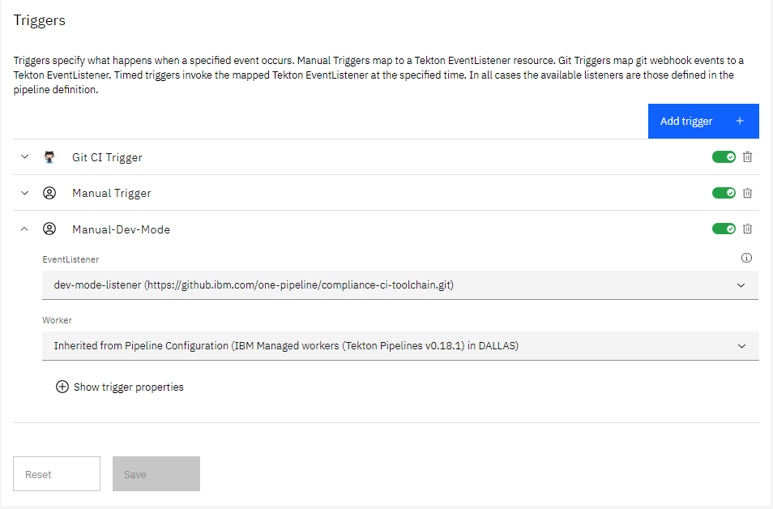
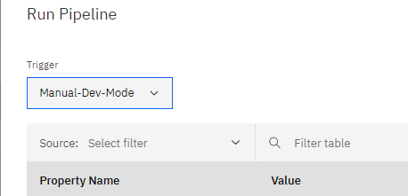

#  Shift-Left Continuous Integration Toolchain

This is a CI toolchain template that enables shift-left continuous integration in accordance with the the best practices described in [Service Framework DevOps Specification](https://pages.github.ibm.com/CloudEngineering/system_architecture/devops/). This reference implementation is based on the [Tekton open source technology](https://tekton.dev/) and is a key part of the IBM `one-pipeline` initiative which seeks to enable standardized compliance across DevOps pipelines for [IBM Public Cloud](https://www.ibm.com/cloud/public) service teams.

This toolchain is pre-configured with a simple sample app to enable out of the box evaluation. It features various categories of tasks like static code scanning, unit tests, vulnerability advisories, image signing, source control integration, issue tracking, status checking and so forth. It also is configured with an evidence locker and inventory repository, and is designed to deploy any sample app modifications to an IBM Kubernetes cluster. The image below provides a pictorial overview of the toolchain components and flow.

### Graphic Summary

### To get started, click this button:

### Step by Step Guide

- **[Setup Guide](./docs/compliance-ci-toolchain-setup.md)**: 
If this is your first time running the CI template then you should read the [Setup Guide](./docs/compliance-ci-toolchain-setup.md) before running the toolchain. 

- **[Troubleshooting guide](https://github.ibm.com/one-pipeline/docs/blob/master/troubleshooting.md)**:
If you experience a problem during setup or running your pipelines, check out our [Troubleshooting Guide](https://github.ibm.com/one-pipeline/docs/blob/master/troubleshooting.md) before raising an issue.

It implements the following best practices:

- sanity check the Dockerfile prior to attempting creating the image
- apply Docker signature after Docker unit tests, sanity checks and successful build
- build container image on every Git commit, setting a tag based on build number, timestamp and commit id for traceability
- use a private image registry to store the built image, automatically configure access permissions for target cluster deployment using API tokens than can be revoked
- check container image for security vulnerabilities and add an additional Docker signature upon successful completion
- insert the built image tag into the deployment manifest automatically
- use an explicit namespace in cluster to insulate each deployment (and make it easy to clear, by "kubectl delete namespace")
- checks for the presence of the two signatures before proceeding with the deployment

### Required GitHub Status Checks

Status checks let you know if your commits meet the conditions set for the repository you're contributing to. The toolchain ships with a `CI` and a `PR` pipeline.

Currently these status checks have to be set required in the repository:

      tekton/code-branch-protection
      tekton/code-unit-tests
      tekton/code-cis-check
      tekton/code-vulnerability-scan
      tekton/code-detect-secrets

Also the following branch protection settings need to be enabled in GitHub:

   * Require pull request reviews before merging
   * Dismiss stale pull request approvals when new commits are pushed

They are checked by both `PR` and `CI` pipelines. To configure your repository to pass the branch protection settings checks, read the [Repository Configuration Guide](./docs/github-repository-configuration.md).

---
### Using the development mode
The development mode enables you to quickly test the implementation of your [shift-left compliance one-pipeline.yaml](https://pages.github.ibm.com/one-pipeline/docs/#/custom-scripts) file, without executing any shift-left compliance related task, so as to optimize pipeline execution time.

* Audience: developers in charge of adopting the shift-left compliance CI pipeline for a given component, implementing [corresponding one-pipeline.yaml](https://pages.github.ibm.com/one-pipeline/docs/#/custom-scripts) file.

* Purpose

  - Develop, implement and quickly test a new [shift-left compliance one-pipeline.yaml](https://pages.github.ibm.com/one-pipeline/docs/#/custom-scripts) file using a simplified pipeline.
  - Only execute the various stages of the one-pipeline.yaml file.
  - Skip most of the shift-left compliance related task, hence optimizing the time to execute your code.

* Warning: this mode should be used for **development** purpose **only**, and can not be considered as a replacement of the official shift-left compliance pipelines which remain the reference implementations.

* Prereq: you already created a compliance CI toolchain.

* Set-up
  - Go to the Triggers page of your CI pipeline
  - Create a new development mode trigger:

    - name: pick a name of your choice (ex: `Manual-Dev-Mode`)

    - EventListener: `dev-mode-listener`

    - Save your changes

  

* Run the Development mode pipeline
  - Back to the `PipelineRuns` page, click on the `Run Pipeline button`.
  - Select Dev Mode trigger you just created.
  - Click on the `Run` button.

  

* Development mode pipeline execution
  - Observe: the pipeline is executed without unnecessary shift-left compliance tasks.
  - Iterate until you're satisfied with your one-pipeline.yaml file implementation.

* Switching back to shift-left compliance CI pipeline
Either disable or delete the development mode trigger.

---
### Learn more

* Blog [Continuously deliver your app to Kubernetes with Bluemix](https://www.ibm.com/blogs/bluemix/2017/07/continuously-deliver-your-app-to-kubernetes-with-bluemix/)
* Step by step [tutorial](https://www.ibm.com/cloud/architecture/tutorials/tekton-pipeline-with-compliance-automation-kubernetes) (WiP)
* [Getting started with clusters](https://cloud.ibm.com/docs/containers?topic=containers-getting-started)
* [Getting started with toolchains](https://cloud.ibm.com/devops/getting-started)
* [Documentation](https://cloud.ibm.com/docs/services/ContinuousDelivery?topic=ContinuousDelivery-getting-started&pos=2)
* [Private workers](https://cloud.ibm.com/docs/ContinuousDelivery?topic=ContinuousDelivery-install-private-workers)
* [Artifactory](https://www.ibm.com/garage/method/practices/deliver/tool_artifactory)
* [Working with Tekton pipelines](https://cloud.ibm.com/docs/services/ContinuousDelivery?topic=ContinuousDelivery-tekton-pipelines)
* [Getting started IBM Cloud CLI](https://cloud.ibm.com/docs/cli?topic=cloud-cli-getting-started)
