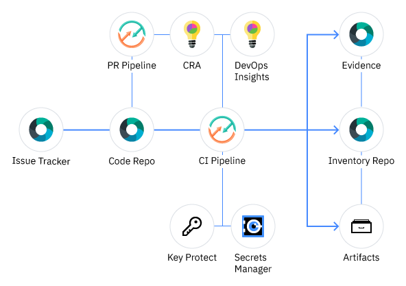

#  Shift-Left Continuous Integration Toolchain

This is a CI toolchain template that enables shift-left continuous integration in accordance with the the best practices described in [Service Framework DevOps Specification](https://pages.github.ibm.com/CloudEngineering/system_architecture/devops/). This reference implementation is based on the [Tekton open source technology](https://tekton.dev/) and is a key part of the IBM `one-pipeline` initiative which seeks to enable standardized compliance across DevOps pipelines for [IBM Public Cloud](https://www.ibm.com/cloud/public)service teams.  

This toolchain is pre-configured with a simple sample app to enable out of the box evaluation. It features various categories of tasks like static code scanning, unit tests, vulnerability advisories, image signing, source control integration, issue tracking, status checking and so forth. It also is configured with an evidence locker and inventory repository, and is designed to deploy any sample app modifications to an IBM Kubernetes cluster. The image below provides a pictorial overview of the toolchain components and flow. 

### Graphic Summary

### To get started, click this button:

For more information about the setup process, check out this guide:

[Setup Guide](./docs/compliance-ci-toolchain-setup.md)

If you get stuck or experience a problem during setup, or running your pipelines, check out our [troubleshooting guide](https://github.ibm.com/one-pipeline/docs/blob/master/faq.md) before raising an issue.

It implements the following best practices:
- sanity check the Dockerfile prior to attempting creating the image
- apply Docker signature after Docker unit tests, sanity checks and successful build
- build container image on every Git commit, setting a tag based on build number, timestamp and commit id for traceability
- use a private image registry to store the built image, automatically configure access permissions for target cluster deployment using API tokens than can be revoked
- check container image for security vulnerabilities and add an additional Docker signature upon successful completion
- insert the built image tag into the deployment manifest automatically
- use an explicit namespace in cluster to insulate each deployment (and make it easy to clear, by "kubectl delete namespace")
- checks for the presence of the two signatures before proceeding with the deployment

### Required GitHub Status Checks

Status checks let you know if your commits meet the conditions set for the repository you're contributing to. The toolchain ships with a `CI` and a `PR` pipeline.
Currently, only `tekton/code-branch-protection` status check has to be set required in the repository. It is checked by both `PR` and `CI` pipelines.
To configure your repository to pass the branch protection settings checks, read the [Repository Configuration Guide](./docs/github-repository-configuration.md).

---
### Learn more

* Blog [Continuously deliver your app to Kubernetes with Bluemix](https://www.ibm.com/blogs/bluemix/2017/07/continuously-deliver-your-app-to-kubernetes-with-bluemix/)
* Step by step [tutorial](https://www.ibm.com/cloud/architecture/tutorials/tekton-pipeline-with-compliance-automation-kubernetes) (WiP)
* [Getting started with clusters](https://cloud.ibm.com/docs/containers?topic=containers-getting-started)
* [Getting started with toolchains](https://cloud.ibm.com/devops/getting-started)
* [Documentation](https://cloud.ibm.com/docs/services/ContinuousDelivery?topic=ContinuousDelivery-getting-started&pos=2)
* [Private workers](https://cloud.ibm.com/docs/ContinuousDelivery?topic=ContinuousDelivery-install-private-workers)
* [Artifactory](https://taas.w3ibm.mybluemix.net/guides#artifactory)
* [Working with Tekton pipelines](https://cloud.ibm.com/docs/services/ContinuousDelivery?topic=ContinuousDelivery-tekton-pipelines)
* [Getting started IBM Cloud CLI](https://cloud.ibm.com/docs/cli?topic=cloud-cli-getting-started)
