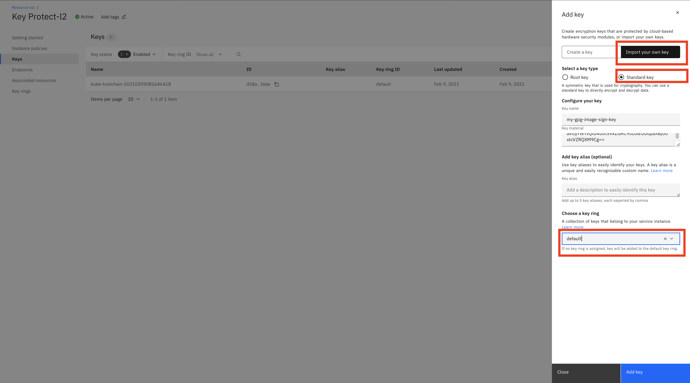
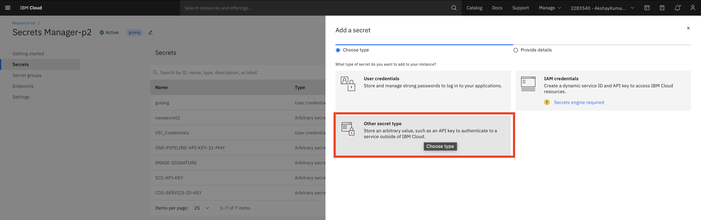
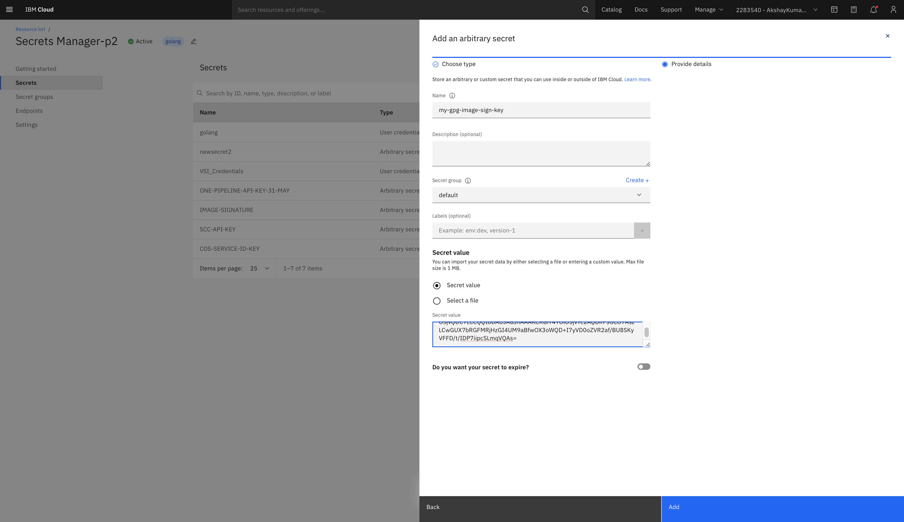

# Generating a GPG key
## Context
Images built by the DevSecOps CI toolchain and recorded in the inventory must be signed before they can be deployed to production.
The CI pipeline uses [Skopeo](https://github.com/containers/skopeo) as the default tool to provide image signing capability.

This document details the steps necessary to create and store a new GPG key, that will be later used by the DevSecOps CI pipeline.
## Install the GPG CLI tools
Download and install the [GPG command line tools](https://www.gnupg.org/download/) for your operating system. Go to the `GnuPG binary releases` section to download the required tools for your operating system.
### OS X
 * Download and install [Mac GPG](https://gpgtools.org/)
### Windows  
 * Download and install [GitBash](https://gitforwindows.org/) (required for `base64` encoding)
 * Verify the version of the GPG installed: from the Git bash command prompt, run
```
$ gpg --version
gpg (GnuPG) 2.2.27
libgcrypt 1.8.7
Copyright (C) 2021 g10 Code GmbH
```
## Generate a GPG key
**IMPORTANT**: Please leave the passphrase and repeat field empty if the generate-key commands open up a dialog asking for a passphrase. This is a limitation with the [(skopeo)](https://github.com/containers/skopeo/issues/1261) utility of the image signing where the pipeline cannot accept a private key protected with passphrase. If you provide the passphrase during creation then your pipeline will fail to decode the certificate and your pipeline will fail at the image signing step.
### OS X and Linux
From your shell prompt, run:
```
gpg --pinentry-mode loopback --passphrase='' --generate-key
```
 * Enter `Real name`
 * Enter `Email address`
 * Enter `O` to initiate key creation
 * Once key is generated, select Option `O`
### Windows
#### GPG Version > 1.4
From the Git bash command prompt, run:
```
gpg --pinentry-mode loopback --passphrase='' --generate-key
```
 * Enter `Real name`: your name
 * Enter `Email address`: you email address
 * Enter `O` to initiate key creation
 * Once key is generated, select Option `O`
#### GPG Version < 1.4 (or any failure with above command)
From the Git bash command prompt, run:
```
gpg --gen-key
```
 * `kind of key`: select Default option `(1) RSA and RSA (default)`
 * `keysize`: keep default (2048)
 * `key validity`: keep default (0 = key does not expire)
 * confirm your choice: enter `y`
 * Enter `Real name`: your name
 * Enter `Email address`: you email address
 * Enter `comment`: any comment of your choice
 * Enter `O` to initiate key creation
## Verification
Verify that the gpg key was created. From the command prompt, run:
```
gpg --list-keys
```
Ensure your key is listed. Example output on Windows:
```
$ gpg --list-keys
/c/Users/ERICJodet/.gnupg/pubring.gpg
-------------------------------------
pub   2048R/1BB354B5 2021-06-08
uid                  Eric Jodet <eric_jodet@fr.ibm.com>
sub   2048R/F91C39A6 2021-06-08
```
## Export the key
This step is optional. Run this command to ensure that the gpg key can be exported. 
```
gpg --export-secret-key <Email Address>
```
**Important**: The raw key exported here must not be copied directly. It is strongly recommended to securely store the key generated in this step in KeyProtect Instance or Secret Manager Instance. Please refer next sections for more details.
## Store the key
> Note: make sure that the key is copied in the correct format to prevent CI pipeline signing error due to import failure. Use `pbcopy` (OS X) or `clip` (Windows / Git bash) in the command below to copy the key content to the clipboard.` 
### In IBM Cloud Key Protect
> Note: double `base64` encoding of the GPG key is required before storing it in your Key Protect Instance. 

Export and copy the GPG key to the clipboard.
#### OS X 
```
gpg --export-secret-key <Email Address> | base64 | base64 | pbcopy
```
#### Windows
```
gpg --export-secret-key <Email Address> | base64 -w0 | base64 -w0 | clip
```
#### Linux 
```
gpg --export-secret-key <Email Address> | base64 | base64
```
1. In your IBM Cloud Console, select the Key Protect Instance where you want to store the GPG Key generated from the steps above.
2. Click on the `Add +` icon on the top right to add new key to the instance.
3. Select `Import your own key` option
4. Select `Select a key type` as **Standard Key**
5. Give appropriate name in the `Key name` field. The stored GPG Key can be retrieved later by this name.
6. Copy the key as exported earlier in the `Key material` field.
    > **Note**: Please ensure that while copying the key and pasting it in `Key material` field, there is no extra line at the end of the key.
7. Select the `Choose a key ring` option as default. 
8. Add the key to your key protect by clicking `Add key` icon at the bottom.

|  |
| :--: |


### In IBM Cloud Secrets Manager
> Note: single `base64` encoding of the GPG key is required before storing it in your Secrets Manager Instance. 

Export and copy the GPG key to the clipboard.
#### OS X
```
gpg --export-secret-key <Email Address> | base64 | pbcopy
```

#### windows
```
gpg --export-secret-key <Email Address> | base64 -w0 | clip
```
#### Linux
```
gpg --export-secret-key <Email Address> | base64
```
1. In your IBM Cloud Console, select the Secret Manager Instance where you want to store GPG Key generated from the steps above.
2. Click on the `Add +` icon on the top right to add new key to the instance.
3. Select `Other secret type` option

|  |
| :--: |

4. Select `Select a key type` as **Standard Key**
5. Give appropriate name in the `Name` field. The stored GPG Key can be retreived later by this name.
6. Choose the option as `Secret value` and paste the key as exported earlier in the `Secret Value` field.
    > **Note**: Please ensure that while copying the key and pasting it in `Secret value` field, there is no extra line at the end of the key.
7. Add the key to your key protect by clicking `Add` icon at the bottom.

|  |
| :--: |

### Export the Private Key and store it directly 
> Notes: 
 * Single `base64` encoding of the GPG key is required before storing it as a secured pipeline property. 
 * **Important**: it is strongly recommended to securely store the GPG key in a KeyProtect or Secret Manager Instance. 
#### OS X / Linux
```
gpg --export-secret-key <Email Address> | base64
```

#### Windows
```
gpg --export-secret-key <Email Address> | base64 -w0
```
